# Gimpies 👟

**Gimpies** is een medewerkers website voor een fictieve schoenenwinkel, ontwikkeld in **Blazor Server** met **MudBlazor**. Dit project heb ik gemaakt voor een bonus opdracht voor mijn studie Software Developer. Dit is de 2de keer dat ik met C# heb gewerkt, eerder heb ik een kleine console applicatie voor school moeten maken. Verder is dit geheel mijn eerste keer werken met Blazor en MudBlazor.

---

## ⚡ Gebruikte Tools & Frameworks

- **.NET 9.0**
- **Blazor Server**
- **MudBlazor 8.\*** (UI componenten)
- **Entity Framework Core 9.1.0** (Database management)
- **ASP.NET Core Authentication 2.3.0** (Authenticatie en autorisatie)
- **SQL Server 9.1.0** (Relationele database)

---

## 👤 Medewerkers Rollen

### 🛒 **Inkoopmedewerker**
- Voorraad schoenen bekijken
- Schoenen inkopen

### 💰 **Verkoopmedewerker**
- Voorraad schoenen bekijken
- Schoenen verkopen

### 📊 **Manager**
- Voorraad schoenen bekijken
- Schoenen beheren (toevoegen, bewerken, verwijderen)
- Werknemers beheren
- Statistieken bekijken

---

## 🔐 Authenticatie & Validatie

- **Registreren en Inloggen** met volledige validatie:
  - Controle op lege velden
  - Wachtwoord controle: minimaal aantal karakters, hoofdletters, cijfers, etc.
  - Geldige e-mail vereist
  - Gebruiksrsnaam en e-mail controle: deze moet uniek zijn en dus niet al bestaan.
  
- **ASP.NET Core Authentication** zorgt voor veilige toegang op basis van de drie rollen.

- **Notificaties** voor alle acties (succes, foutmeldingen, waarschuwingen).

---

## ❌ Error Handeling
- Werkt met http error codes, geef de gebruiker de juiste info over de error en hoe dit op te lossen.
- Custom program errors: Deze errors krijg je doordat er een nieuwe error word "gegooid" in een try-catch statement.
  - 0: Er is een fout opgetreden bij het verwerken van je verzoek!
  - 1: Er is een onbekende fout opgetreden!

---

## 🌗 Thema Switcher

- Gebruikers kunnen eenvoudig schakelen tussen **Dark Mode** en **Light Mode**.

---

## 💾 Database

- **Genormaliseerde database** om dubbele data te voorkomen.
- Beheerd via **Entity Framework Core**.

---

## 📸 Screenshots

### 🌐 Database Schema
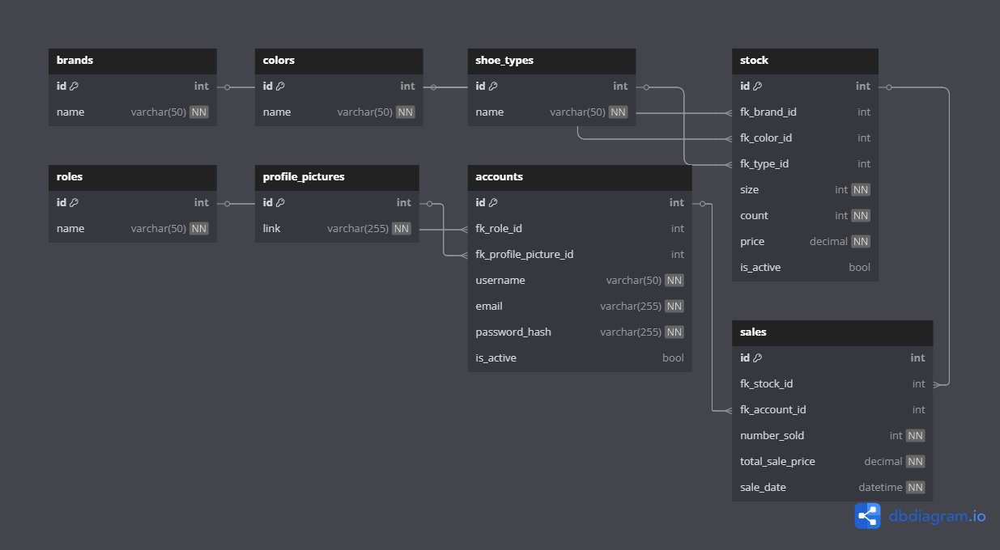

### 📥 Login Pagina
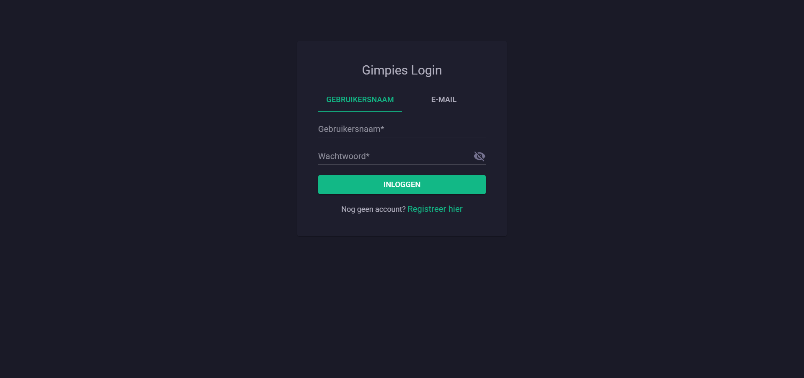

### 📝 Registratie Pagina
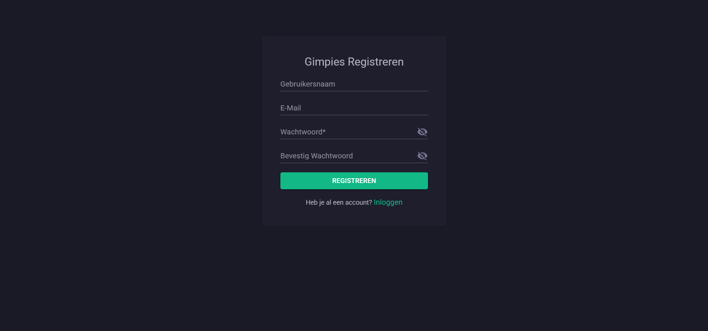

### 💻 Dashboard (imgur was offline dus de profielfoto laad niet)
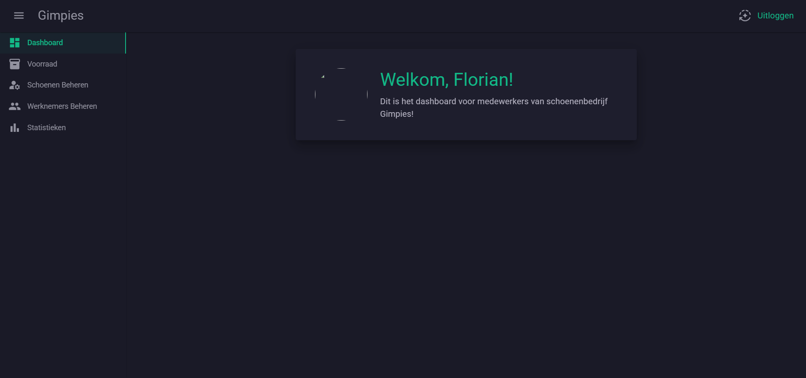

### 📦 Voorraad Overzicht
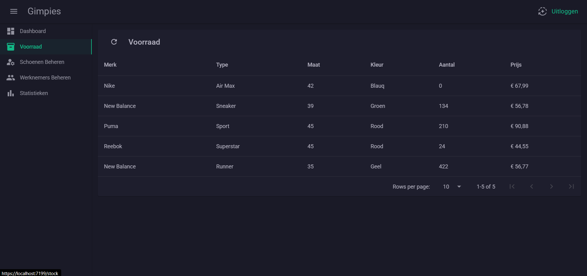

### 🛍️ Inkoop Pagina
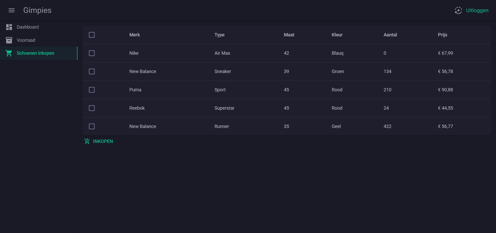

### 💵 Verkoop Pagina
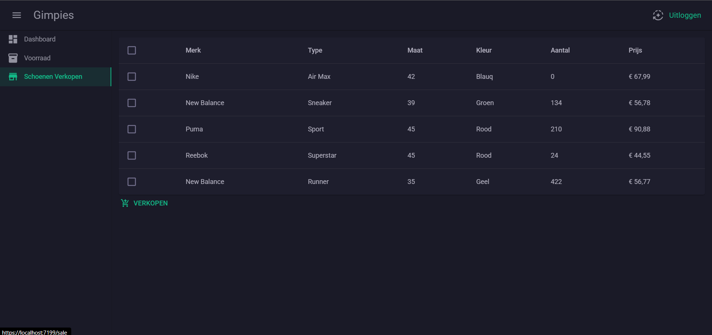

### 📈 Statistieken Pagina (Manager)
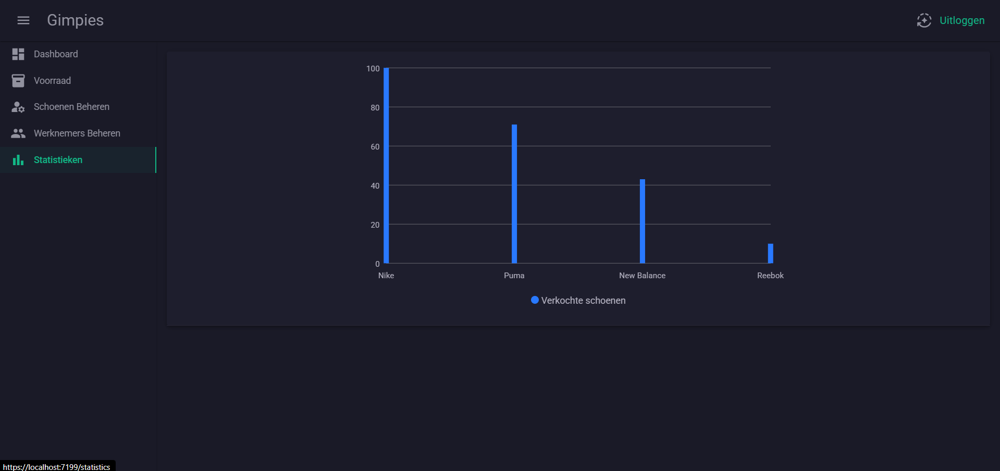

### ⚙️ Voorraadbeheer (Manager)
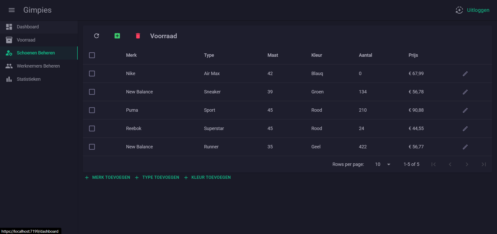

### ⚙️ Werknemersbeheer (Manager)
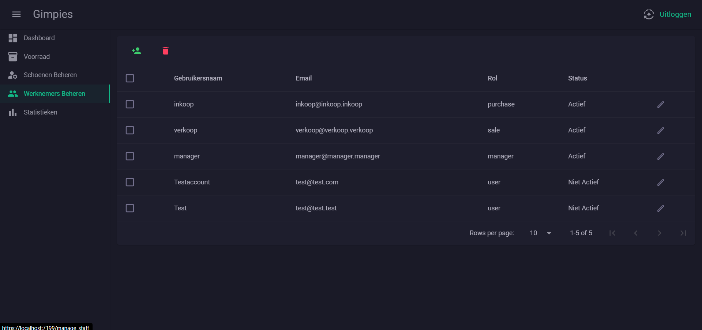

### ❌ Error Handeling
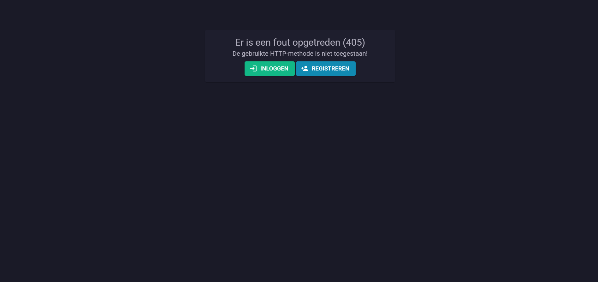

---

## 🚀 Installatie

1. **Clone de repository:**
   ```bash
   git git@github.com:Florianvhunnik/GimpiesBlazor.git
2. **Open het project in Visual Studio**
3. **Configureer de databaseconnectie in appsettings.json**
4. **Voer migraties uit en update de database:**
   ```bash
   dotnet ef database update
5. **Build, start en bekijk wijzegingen**:
   ```bash
   dotnet watch
